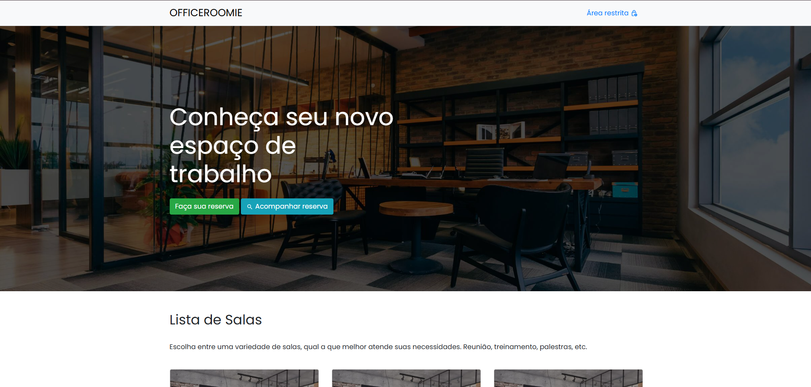
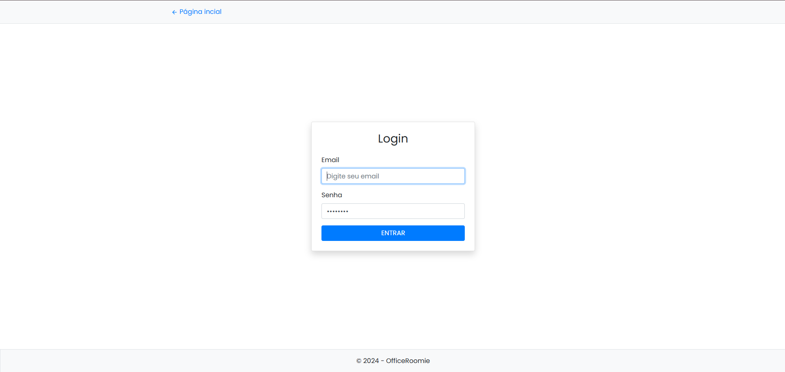
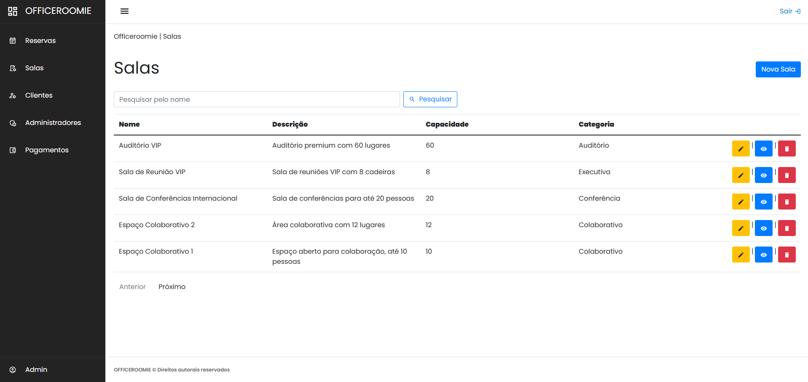
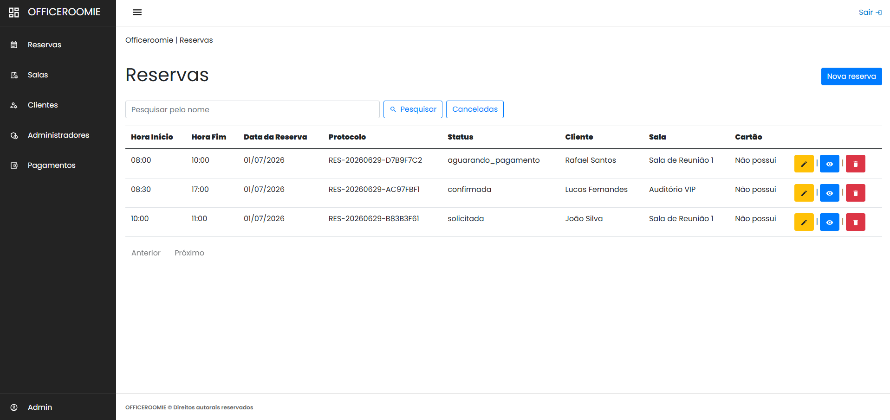
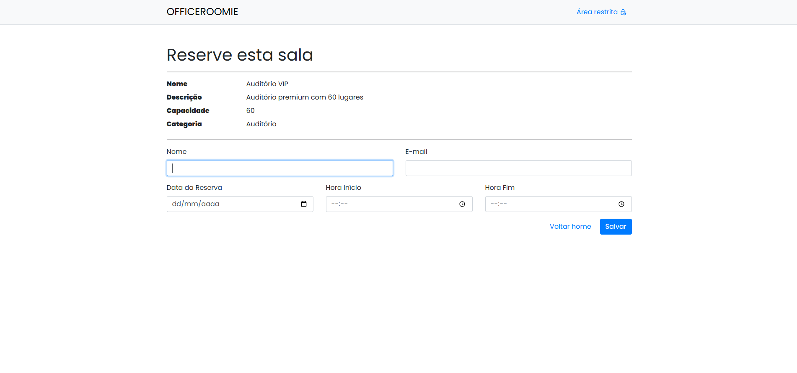
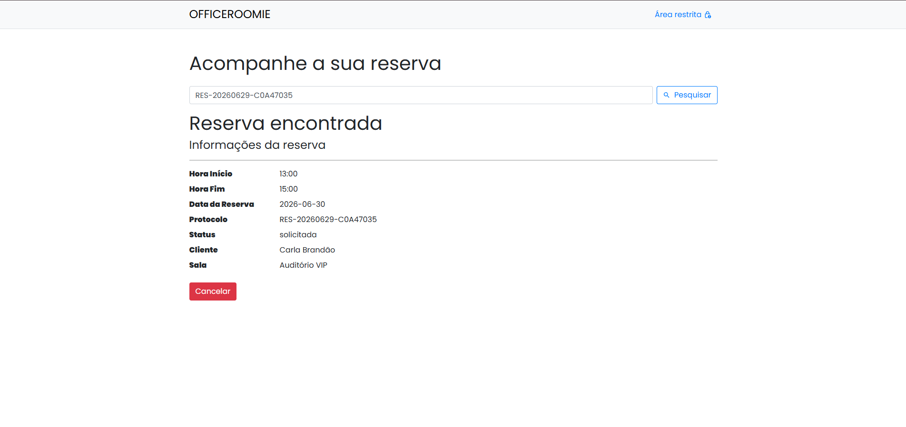

# OfficeRoomie

<div align="center">

| | | |
|---|---|---|
|  |  |  |
|  |  |  |

</div>

Sistema de gerenciamento de reserva de salas corporativas desenvolvido em ASP.NET Core 8.0 MVC.

## Funcionalidades

- Catálogo público de salas com busca e paginação
- Reserva de salas por clientes com geração de protocolo
- Consulta e cancelamento de reservas por protocolo
- Dashboard administrativo com CRUD completo
- Gerenciamento de salas, clientes, administradores e cartões
- Autenticação por cookies e JWT
- Paginação nas listagens
- Seeder para dados iniciais
- Suporte a múltiplos bancos de dados (SQLite, MySQL, SQL Server)
- Conteinerização com Docker

## Tecnologias

- .NET 8.0
- ASP.NET Core MVC com Razor Pages
- Entity Framework Core 8.0
- BCrypt.Net-Next para hash de senhas
- Bootstrap 5, jQuery e jQuery Validation
- SQLite / MySQL / SQL Server
- Docker

## Estrutura do Projeto

```
OfficeRoomie/
├── Controllers/       # Controladores da aplicação
├── Database/          # DbContext, Migrations e Seeders
├── Extensions/        # Métodos de extensão para configuração
├── Helpers/           # Utilitários (password, protocolo)
├── Models/            # Entidades e ViewModels
├── Security/          # Configurações de segurança
├── Services/          # Serviços (e-mail)
├── Views/             # Razor Views
├── wwwroot/           # Arquivos estáticos
├── Program.cs         # Ponto de entrada
└── OfficeRoomie.csproj
```

## Configuração

### Banco de Dados

Defina o provedor no `appsettings.json`:

```json
"DatabaseProvider": "SQLite"
```

Opções: `SQLite`, `Localdb`, `MySql`, `SqlServer`, `Production`

### Conexões

Configure a connection string correspondente ao provedor escolhido no `appsettings.json`.

### Executar

```bash
dotnet restore
dotnet run
```

O banco de dados é criado automaticamente na primeira execução com dados iniciais (administrador, 20 clientes e 20 salas).

### Acesso Administrador

- **E-mail:** email@email.com
- **Senha:** 123

## Docker

### Build da imagem

```bash
docker build -t officeroomie .
docker run -p 8080:80 officeroomie
```

### Docker Compose (produção)

Sobe três serviços: banco MySQL, aplicação .NET e proxy Nginx.

```bash
docker compose up -d
```

Acesse em http://localhost

#### Serviços

| Serviço | Imagem | Porta |
|---|---|---|
| `db` | mysql:8.0 | 3306 |
| `app` | officeroomie (build local) | 8080 |
| `nginx` | nginx:alpine | 80 |

#### Credenciais do banco

- **Banco:** officeroomie
- **Usuário:** officeroomie
- **Senha:** officeroomie_pass

#### Parar os serviços

```bash
docker compose down
```

Para remover também o volume do banco:

```bash
docker compose down -v
```
